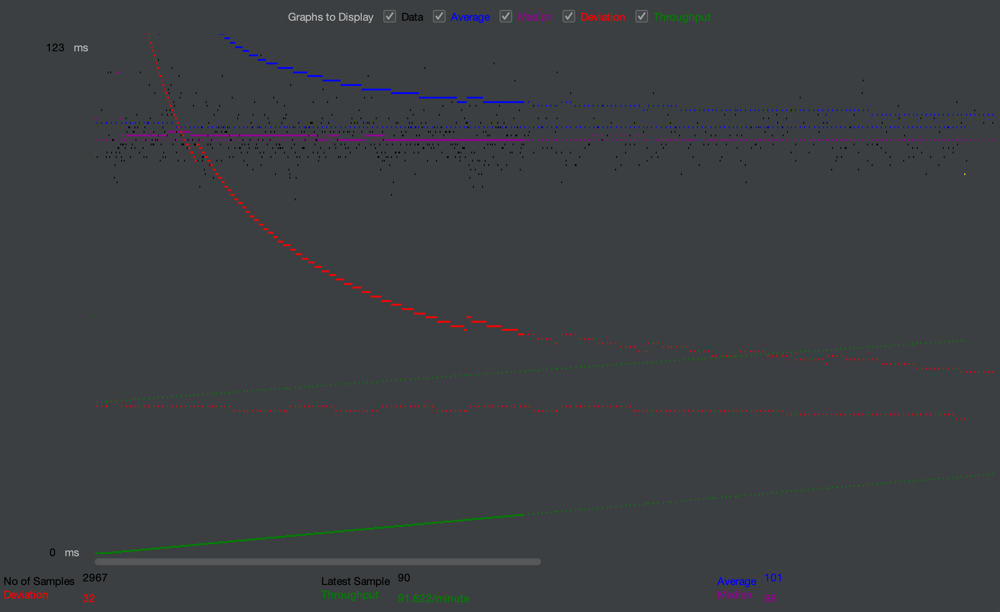
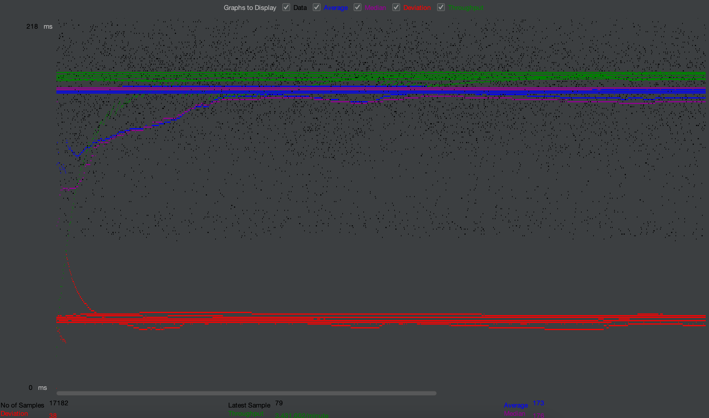
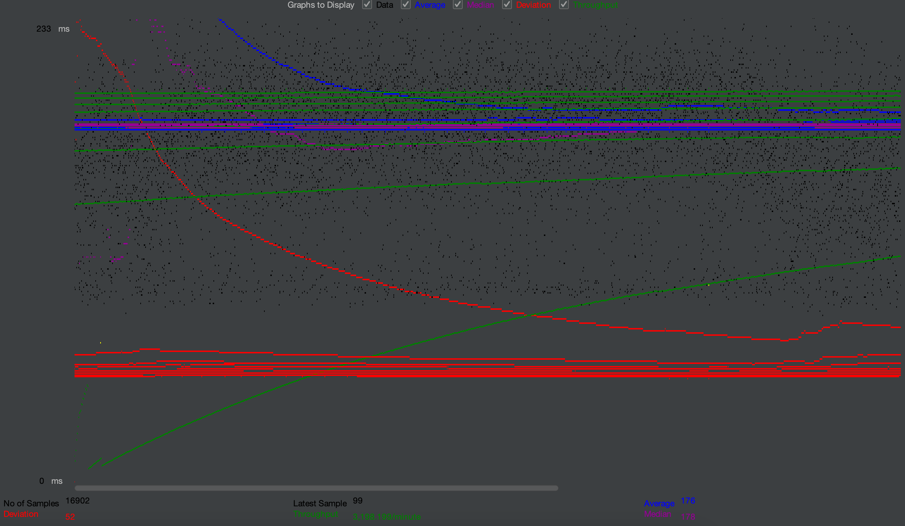
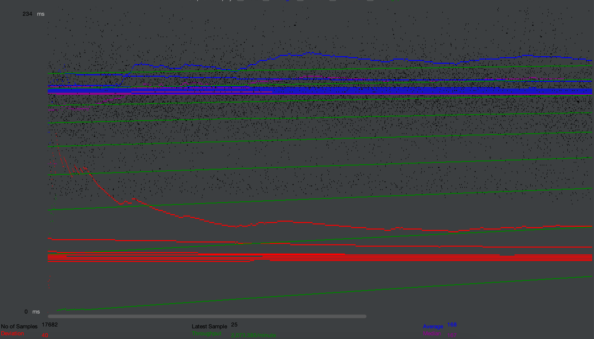
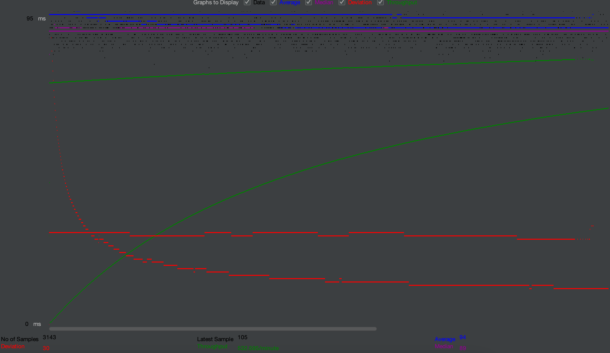
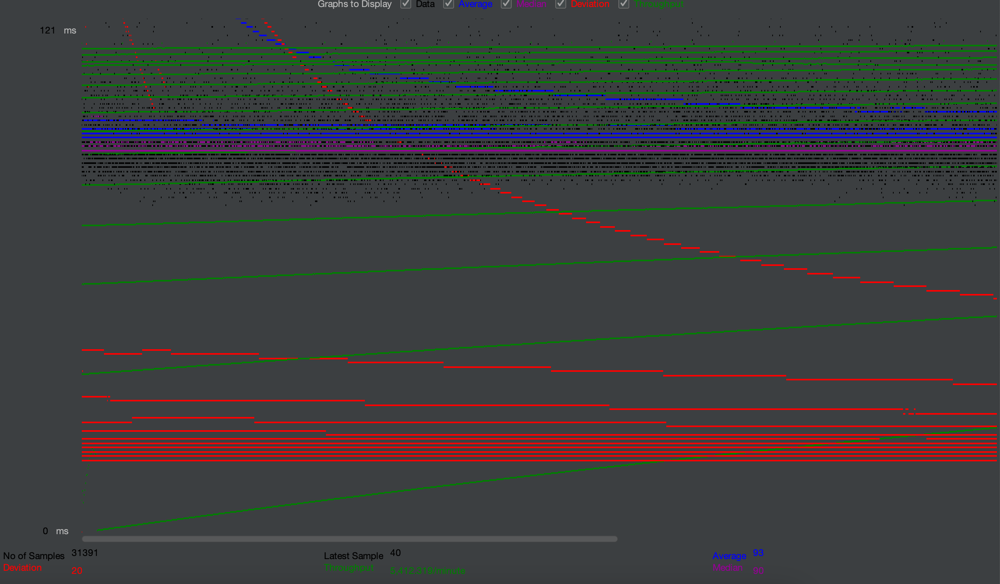

# 122B- PROJECT 1 + 2

Readme document for *Derek Adlai Trujillo & Hoa Ta*. Student IDs: *66456950 & 13506664*


# URL

Project 1 URL: https://youtu.be/JTTP5FPP6ew

Project 2 URL: https://youtu.be/69HNnC-mfoA

Project 3 URL: https://youtu.be/iCrWqTFTa_g

Project 4 URL: https://youtu.be/VRLivF8768w

Project 5 URL: https://youtu.be/QAwVj9nt4R0

# Substring Matching Design
When user enter to search form, we take the input and search based on the input they pass in. (case sensitive).

# whereClause:
... where movies.title LIKE %aa%  
... AND movies.director LIKE %aa%  
AND stars.name LIKE %aa%  
(should not support substring search)

## Contributions
**Hoa Ta: ** Wrote movie list page, single movie page structure, link pages together, add Icons and css for files.
Implement Login page, search page, filter, front end
**Derek Adlai Trujillo: ** 
- Implemented single movie page and individual star page 
- Wrote and optimized SQL queries to selected movies provided their respective movieIds 
- Created AWS Instances to use for deployment
- Setup JMeter Test Plan and tested using various threading techniques to optimize website performance 
- 

## Special Instructions
```mysql -u mytestuser-p < create_table.sql``` altered to ```mysql -u mytestuser -p < createtable.sql``` since our sql file has a slightly different name.
```cp ./target/*.war /var/lib/tomcat10/webapps/``` altered to ```sudo cp ./target/*.war /var/lib/tomcat10/webapps/``` to bypass permission restrictions

## Parsing Optimizations
- Implemented a 3 pool threader to execute multiple SQL queries at the same time
- Implemented parallelization to divide the data into smaller chunks

## List filenames with Prepared Statements
- EmployeeLoginServlet.java
- GenresSearchServlet.java
- GenresServlet.java
- LoginServlet.java
- MetadataServlet.java
- MoviesServlet.java
- PaymentServlet.java
- SalesServlet.java
- SingleMovieServlet.java
- SingleStarsServlet.java
- UpdateCustomerSecurePassword.java
- UpdateSecurePassword.java

## Autocomplete
- Autocomplete an was done to suggest things alphabetically and separate words according to spaces to use as prefixes in the full text search.

## Changes to Instructions
- "stars" string used instead of "love" to check caching since love was used for testing in order to demonstrate that our project uses caching after inputting a recently added word in the search box.

======//======//=====//======//=====

- # General
    - #### Team#: 2023-fall-cs122b-coffee

    - #### Names: Derek Adlai Trujillo & Hoa Ta

    - #### Video Demo Links:
      Project 1 URL: https://youtu.be/JTTP5FPP6ew

      Project 2 URL: https://youtu.be/69HNnC-mfoA

      Project 3 URL: https://youtu.be/iCrWqTFTa_g

      Project 4 URL: https://youtu.be/VRLivF8768w

      Project 5 URL: https://youtu.be/QAwVj9nt4R0

    - #### Instruction of deployment:
      - Instance 1: http://18.191.77.53:8080/122b-project/login.html
      - Default Apache: http://18.191.77.53/122b-project/
      - Instance 2: http://18.217.232.57:8080/122b-project/
      - Instance 3: http://3.137.151.92:8080/122b-project/																							

    - #### Collaborations and Work Distribution:


- # Connection Pooling
    - #### Include the filename/path of all code/configuration files in GitHub of using JDBC Connection Pooling.

  Filename using JDBC Connection Pooling:
    - AddMovie.java
    - AddStar.java
    - EmployeeLoginServlet.java
    - GenresSearchServlet.java
    - GenresServlet.java
    - LoginServlet.java
    - MetadataServlet.java
    - MoviesServlet.java
    - PaymentServlet.java
    - SalesServlet.java
    - SearchSuggestionServlet.java
    - SingleMovieServlet.java
    - SingleStarsServlet.java

In the META-INF/context.xml file of every instance, I included two additional properties: factory and maxTotal, specifying the values for maxTotal and maxIdle. Additionally, I make sure the Java servlets that use pooling to use a DataSource to obtain database connections.

```<?xml version="1.0" encoding="UTF-8"?>

    <Context>
    
        <!-- Defines a Data Source Connecting to localhost moviedb-->
        <Resource name="jdbc/moviedb"
                  auth="Container"
                  driverClassName="com.mysql.cj.jdbc.Driver"
                  factory="org.apache.tomcat.jdbc.pool.DataSourceFactory"
                  maxTotal="100" maxIdle="30" maxWaitMillis="10000"
                  type="javax.sql.DataSource"
                  username="mytestuser"
                  password="My6$Password"
                  url="jdbc:mysql://localhost:3306/moviedb?autoReconnect=true&amp;allowPublicKeyRetrieval=true&amp;useSSL=false&amp;cachePrepStmts=true"/>
    </Context>
```


- #### Explain how Connection Pooling is utilized in the Fabflix code.

Connection pooling is used to enhance the performance and efficiency of database connectivity in applications. In our Fabflix website code, it involves creating and managing a pool of database connections that can be reused (maxTotal="100" maxIdle="30" ), rather than opening a new database connection every time one is needed. We optimize the utilization of database connections by reusing the database connection instead of creating a new connection every time, leading to improved performance and resource management.


- #### Explain how Connection Pooling works with two backend SQL.
The load balancer distributes incoming requests from the application to multiple database servers. Each backend database server has its own connection pool as configured on Resource tag in context.xml file. After executing the database operations, the connection is returned to the respective connection pool. The connection pools on each backend database server manage the actual connections. This will optimize resource usage.


- # Master/Slave
    - #### Include the filename/path of all code/configuration files in GitHub of routing queries to Master/Slave SQL.

  We change the proxy on /etc/apache2/sites-enabled/000-default.conf to route the request to Master/Slave instances.
  
   ``` <Header add Set-Cookie "ROUTEID=.%{BALANCER_WORKER_ROUTE}e; path=/" env=BALANCER_ROUTE_CHANGED

    <Proxy "balancer://TomcatPooling_balancer">
        BalancerMember "http://172.31.41.107:8080/cs122b-project5-TomcatPooling-example"
        BalancerMember "http://172.31.35.171:8080/cs122b-project5-TomcatPooling-example"
    </Proxy>
    
    <Proxy "balancer://Project_balancer">
        BalancerMember "http://172.31.41.107:8080/122b-project" route=1
        BalancerMember "http://172.31.35.171:8080/122b-project" route=2
        ProxySet stickysession=ROUTEID
    </Proxy>

    <Proxy "balancer://Session_balancer">
        BalancerMember "http://172.31.41.107:8080/cs122b-project2-session-example" route=1
        BalancerMember "http://172.31.35.171:8080/cs122b-project2-session-example" route=2
        ProxySet stickysession=ROUTEID
    </Proxy>

    <VirtualHost *:80>
        ServerAdmin webmaster@localhost
        DocumentRoot /var/www/html
        ErrorLog ${APACHE_LOG_DIR}/error.log
        CustomLog ${APACHE_LOG_DIR}/access.log combined
    
        ProxyPass /cs122b-project5-TomcatPooling-example balancer://TomcatPooling_balancer
        ProxyPassReverse /cs122b-project5-TomcatPooling-example balancer://TomcatPooling_balancer
    
        ProxyPass /122b-project balancer://Project_balancer
        ProxyPassReverse /122b-project balancer://Project_balancer
        #RewriteEngine On
        #RewriteCond %{REQUEST_METHOD} ^POST$
        #RewriteRule ^(/122b-project(/.*)?)$ "http://172.31.41.107:8080$1" [P]
    
        ProxyPass /cs122b-project2-session-example balancer://Session_balancer
        ProxyPassReverse /cs122b-project2-session-example balancer://Session_balancer
    </VirtualHost>
   ```


- #### How read/write requests were routed to Master/Slave SQL?

Instance 1 will receive request and distribute request to Master/Slave to handle.
Write requests only send to Master instance while Read requests can either send to Master or Slave.


- # JMeter TS/TJ Time Logs
    - #### Instructions of how to use the `log_processing.*` script to process the JMeter logs.

  - log_processing.* is named log_parser.py in our github repo.

  1)  Open the parser using the IDE of your choice and adjust the following line ```log_file_path = '/your/log/file/path/log_file.txt'```.
  2)  Run the script to print out the averages in the terminal.

 - This process is shown in the final minutes of our demo video!

- # JMeter TS/TJ Time Measurement Report

| **Single-instance Version Test Plan**          | **Graph Results Screenshot** | **Average Query Time(ms)** | **Average Search Servlet Time(ms)** | **Average JDBC Time(ms)** | **Analysis** |
|------------------------------------------------|------------------------------|----------------------------|-------------------------------------|---------------------------|--------------|
| Case 1: HTTP/1 thread                          |  | 28.591 ms                   | 14.297 ms                                  | 14.294 ms                       | With only one thread running at a time, both the average search servlet time and the JDBC time are very fast.           |
| Case 2: HTTP/10 threads                        |  | 174.908 ms                    | 87.455 ms                              | 87.453 ms                     | After adding more thread groups, it looks like our website can still execute the servlet and jdbc quite quickly but not as quick as one thread group.           |
| Case 3: HTTPS/10 threads                       |  | 175.211 ms                     | 87.606 ms                           | 87.605 ms                  | Using our secured website, we have about the same time it takes to run our search servlet as well as jdbc as our unsecured website.          |
| Case 4: HTTP/10 threads/No connection pooling  |  | 160.008 ms                   | 80.005 ms                         | 80.003 ms                  | Our unscaled website seems to be a bit faster without connection pooling, saving about 6-7 ms of average execution time            |

| **Scaled Version Test Plan**                   | **Graph Results Screenshot** | **Average Query Time(ms)** | **Average Search Servlet Time(ms)** | **Average JDBC Time(ms)** | **Analysis** |
|------------------------------------------------|------------------------------|----------------------------|-------------------------------------|---------------------------|--------------|
| Case 1: HTTP/1 thread                          |  | 11.88 ms                       | 5.942 ms                         | 5.938 ms                  | Compared to our single instance without scaling, our website cuts the time it takes for the search servlet and jdbc by almost half, increasing the performance of our website on a single thread.           |
| Case 2: HTTP/10 threads                        |  | 18.156 ms                     | 9.079 ms                           | 9.077 ms                   | Compared to our single instance, our scaled website is now querying at a much faster rate with 10 thread groups, cutting down the time it takes to search a movie by 1/10.           |
| Case 3: HTTP/10 threads/No connection pooling  |  | 38.154 ms                    | 19.078 ms                           | 19.076 ms                 | Our scaled website with no connection pooling is a bit slower than with connection pooling. Even so, the average time it takes to conduct our search servlet and jdbc is much faster than our single instance with connection pooling and without.       |
